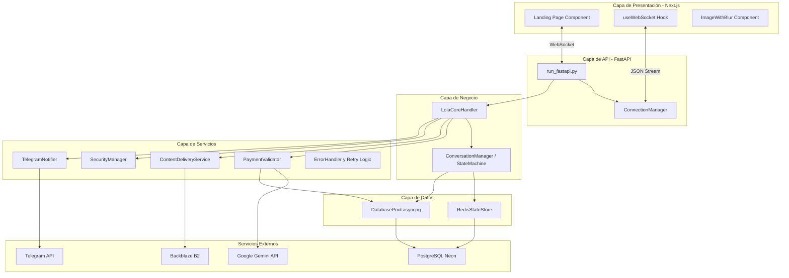
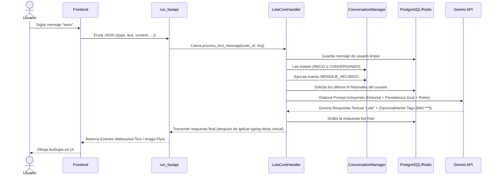
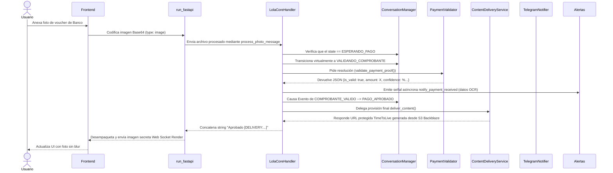
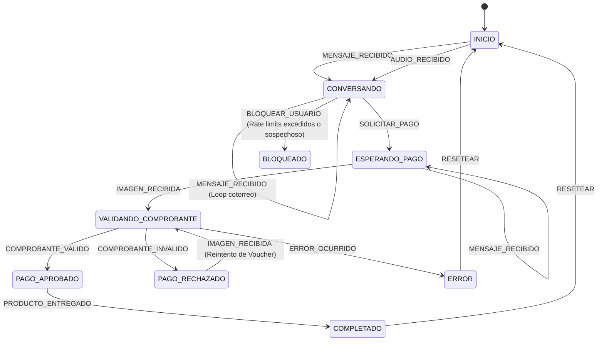

# Arquitectura — Lola Jiménez Studio

## Diagrama de Capas

## Componentes del Backend
* `api/run_fastapi.py`: Entry point global, levanta la app FastAPI, entrega recursos estáticos `next_static` y expone Socket web a un `websocket_endpoint`. Responsabilidad: Orquestar el entorno unificado de la red.
* `core/core_handler.py` (`LolaCoreHandler`): Administrador de flujo natural. Escucha strings puros, inyecta estado temporal (como horários y historiales) y comanda interacciones. Responsabilidad: Gestionar respuestas de IA correctas e intercepción de fotos.
* `core/state_machine.py` (`ConversationManager`): Control de Máquina de Estados Finita; provee transiciones para prevenir saltos irregulares. Responsabilidad: Validar lógicamente en qué fase de venta habita el usuario.
* `services/payment_validator.py` (`PaymentValidator`): Motor anti-fraude operado por IA Vision. Responsabilidad: Confirmar hashes de fotos duplicadas comprobando contra BD y realizar validaciones complejas de transferencias.
* `services/content_delivery.py` (`ContentDeliveryService`): Manager de entrega final que genera URLs con time-to-live temporales. Responsabilidad: Comunicación confiable con Backblaze.
* `storage/redis_store.py` (`RedisStateStore`): Abstracción asíncrona de almacenamiento tipo memoria principal con sub-conexiones de respaldo PG. Responsabilidad: Leer / Grabar metadata vital rápidamente de cara a solicitudes concurrentes directas.
* `database/database_pool.py` (`DatabasePool`): Repositorio madre de asyncpg encapsulando pools reactivos. Responsabilidad: Leer UUIDs, gestionar queries manualmente y recuperar respaldos de historial.

## Flujo Principal: Mensaje de Texto

## Flujo de Validación de Pago

## Máquina de Estados

## Componentes del Frontend
* **`LolaJiménezStudioLandingPage`**: El componente base maestro (JSX). Estructura el renderizado HTML general unificado del sitio web: Hero Screen, Portfolio list y agrupa los Dialogs (Modales) de "ChatPrivado". Funciona interactuando bajo el motor Client Side React (con dependencias de Framer-Motion para animaciones fluidas CSS espaciales).
* **`ImageWithBlur`**: Componente Custom encargado de blindaje visual y anti robo de imágenes del landing, integrando escuchas que bloquean drag actions nativos `.preventDefalt()` y aplican capas borrosas si el Window VisualViewport se expande a escalas prohibidas (Event scale > 1.25).
* **`useWebSocket`**: Hook en `/lib/useWebSocket`. Aísla la inicialización de Socket.IO / WSS. Mantiene en un Array state dinámico las burbujas en cache. Exporta utilitarios `connect`, `disconnect`, `sendText`, y `sendImage` junto al enumerador situativo general.

## Servicios Externos
| Servicio | Uso | Módulo que lo consume | Obligatorio/Opcional |
|---|---|---|---|
| PostgreSQL (Neon) | Almacenaje asertivo universal (identificadores, historial, comprobación anti-pHashes transaccionales duplicados) | `database_pool.py`, Repositorios FSM y Soporte `redis_store.py` | Obligatorio |
| Google Gemini API | Motor de inferencia natural textual (Flash 2.5) e interrogatorio Visión AI avanzado OCR a vauchers | `core_handler.py`, `payment_validator.py` | Obligatorio |
| Backblaze B2 | Receptáculo general de Storage y expositor dinámico (Signed Expire URLs) de redenciones | `content_delivery.py` | Obligatorio |
| Redis Cloud | Operador primario en RAM de las variables efímeras temporales del Chat y metadatos FSM | `redis_store.py` | Opcional |
| Telegram Bot API | Gateway HTTP pasivo de disparo asíncrono hacia el mantenedor ante pagos de alta relevancia percibidos | `telegram_notifier.py` | Opcional |
